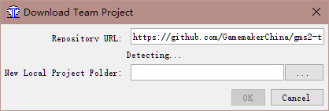
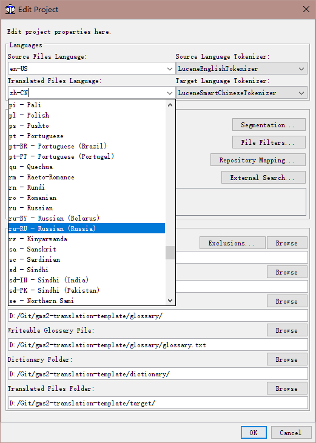
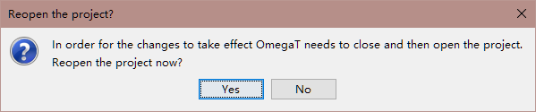
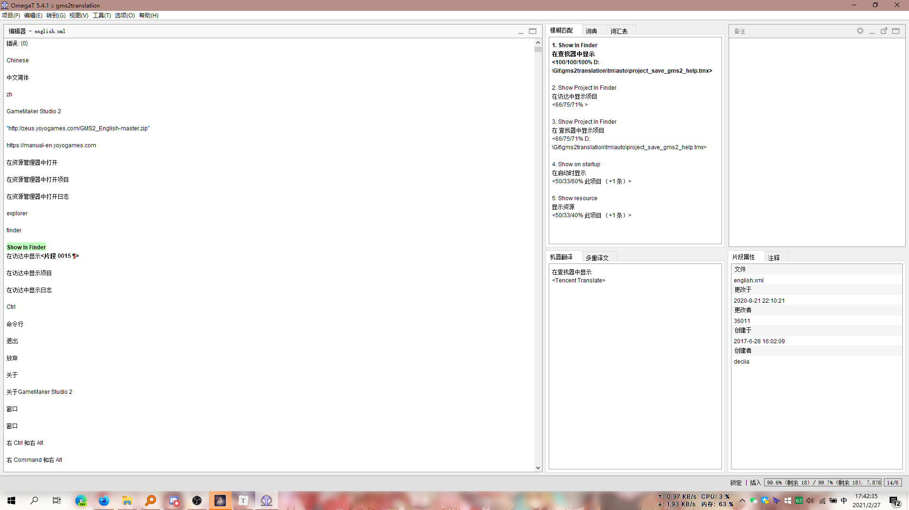
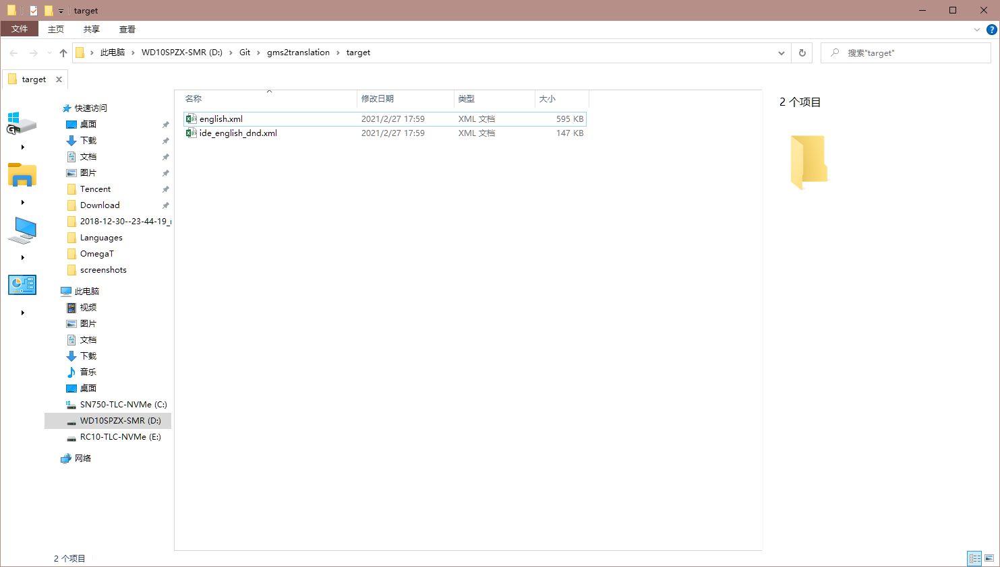

# gms2-translation-template
Translation template for GameMaker Studio 2 IDE.(OmegaT project)

Default is en-US to zh-CN, you can change it later.

## Notes

OmegaT cannot directly recognize GameMaker Studio 2's Language CSV files (Magenta CE CSV files is not compatible with it), export the fields that need to be translated as an XML file as an intermediate file (Export to XML Spreadsheet 2003 from Microsoft Excel).

## How to use

Need:
OmegaT  
Microsoft Excel (2010 and later) (Or alternatives, e.g. WPS Office Spreadsheets, LibreOffice Calc)  
Notepad3(optional)  

More info

### Step 1: Download

Fork and pull this repository by OmegaT (`Project --> Download Team Project`).

Enter your forked repository URL:

### Step 2: Change your target language
Go to `Project --> Properties` (Or press `Ctrl+E`), change value in `Translated Files Language` and Press `OK` and reopen the project to apply.

### Step 3: Start your work.

P.S.: This is my work layout, you can customize your layout.

### Step 4: Export and apply translated files.

Go to `Project --> Create Translated Documents` (Or press `Ctrl+D`) to generate the translated files. then go to `Project --> Access Project Contents --> Target Files` to find them.

