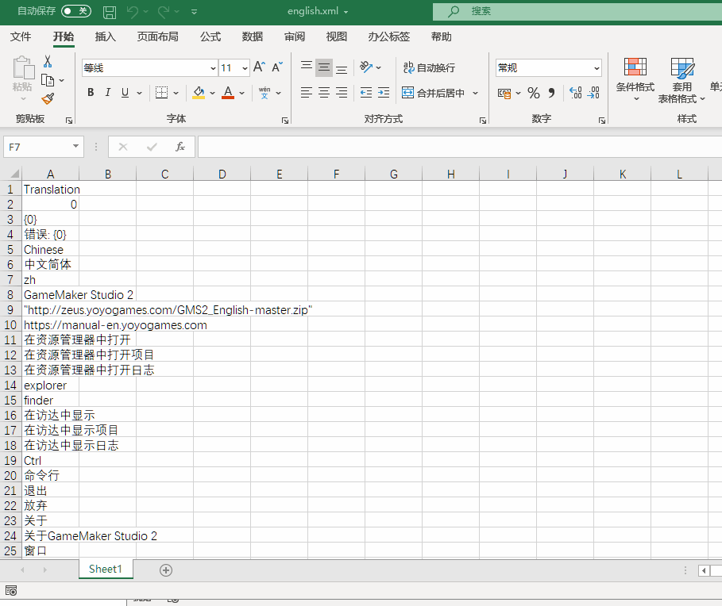
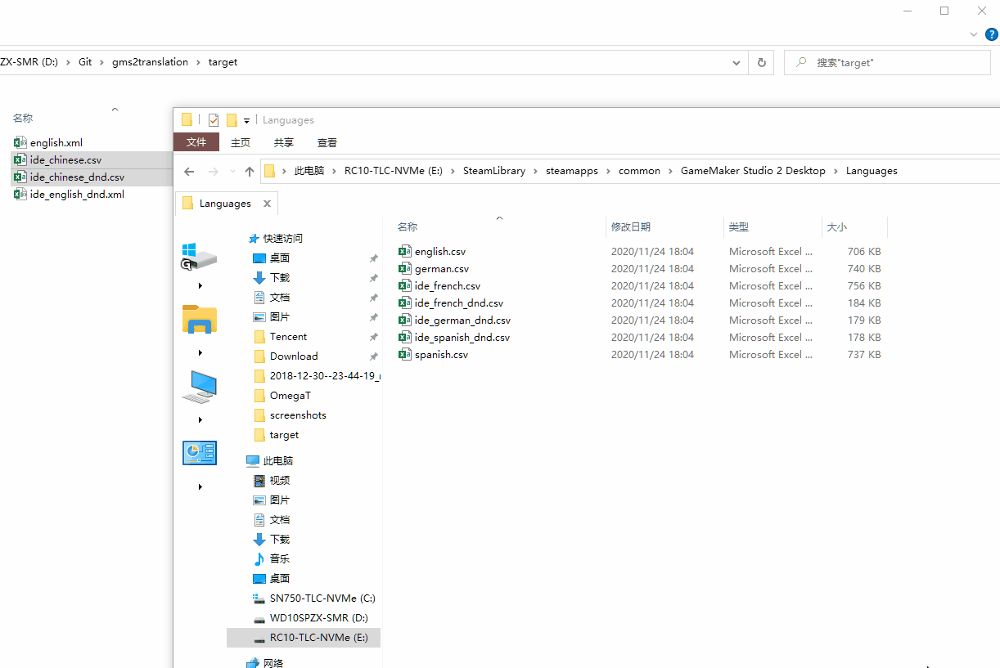

# gms2-translation-template
Translation template for GameMaker Studio 2 IDE.(OmegaT project)

Default is en-US to zh-CN, you can change it later.

如果你想下载汉化文件，请转到：[https://github.com/GamemakerChina/gms2translation](https://github.com/GamemakerChina/gms2translation)

## Notes

OmegaT cannot directly recognize GameMaker Studio 2's Language CSV files (Magenta CE CSV files is not compatible with it), export the fields that need to be translated as an XML file as an intermediate file (Export to XML Spreadsheet 2003 from Microsoft Excel).

## How to use

Need:
OmegaT  
Microsoft Excel (2010 and later) (Or alternatives, e.g. WPS Office Spreadsheets, LibreOffice Calc)  
Visual Studio Code (You can use other code editors instead. e.g. Notepad3, Sublime Text)  

More info

### Step 1: Download

Fork and pull this repository by OmegaT (`Project --> Download Team Project`).

Enter your forked repository URL:

### Step 2: Change your target language
Go to `Project --> Properties` (Or press `Ctrl+E`), change value in `Translated Files Language` and Press `OK` and reopen the project to apply.

### Step 3: Start your work

P.S.: This is my work layout, you can customize your layout.

OmegaT tutorial is inconvenient to explain too much here, if you need help, you can use a search engine(e.g. Google)

### Step 4: Export translated files

Go to `Project --> Create Translated Documents` (Or press `Ctrl+D`) to generate the translated files. then go to `Project --> Access Project Contents --> Target Files` to find them.

### Step 5: Apply translated

Copy an original CSV file `english.csv` from GameMaker Studio 2 IDE `Languages` directory (e.g. `C:\Program Files\GameMaker Studio 2-Beta\Languages`).

(DnD is in `C:\Program Files\GameMaker Studio 2-Beta\DnDLibs\YoYo Games\Languages`. To prevent duplication of naming, please rename it to `english_dnd.csv`)

Paste the two files into the directory you prepared (I used to paste them into the target folder of the project)

Open `english.xml` and `english.csv` by Excel, click column A press `Ctrl+C` to copy in `english.xml`， then click column C in `english.csv`  press `Ctrl+V` to paste and overwrite data.

For `english_dnd`, use the same approach.

Finally, save them.

### Step 6: Rename files

Rename modified `english.csv` and `english_dnd.csv` to your language name (in English).e.g. `chinese.csv` and `chinese_dnd.csv`

### Step 7: Check the file and remove the extra commas(optional if the extra commas exist)

In the process of making language files, extra commas may appear, which will cause GameMaker Studio 2 to fail to recognize the language files correctly. If you find any, please use the code editor to remove them in batches.

In theory, the number of extra commas in each line is the same, you can easily use the "Find-Replace" function of the code editor to remove the commas.

### Step 8: Apply and test translated files

Copy the produced CSV language files back to the `Language` folder of GameMaker Studio 2 IDE.

Open GameMaker Studio 2 IDE, and go to `File --> Preferences --> General Settings --> IDE language`. If the IDE recognizes it correctly, it will be displayed here.

